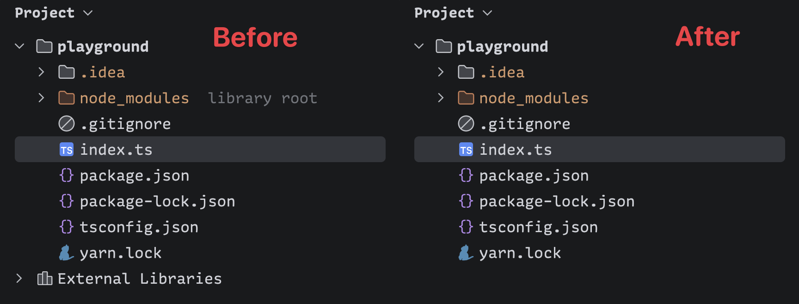

# Clean Project Sidebar

<!-- Plugin description -->
Cleans up the JetBrains Project sidebar by hiding External Libraries and gray library root labels (e.g. next to node_modules).
<!-- Plugin description end -->



## Features

- Hide the `External Libraries` node from the Project tool window.
- Hide gray library-root labels such as `library root` next to folders like `node_modules`.
- Toggle each cleanup independently from IDE settings.

## Settings

Open `Settings > Appearance & Behavior > Clean Project Sidebar`.

Both options are enabled by default:

- `Hide External Libraries`
- `Hide library root text`

## Install From Local Build

Build the plugin zip:

```bash
./gradlew buildPlugin
```

Then install `build/distributions/jetbrains-clean-project-sidebar-*.zip` from `Settings > Plugins > Install Plugin from Disk...`.

## Publish To JetBrains Marketplace

Create a permanent Marketplace token from your JetBrains Marketplace account, then publish with:

```bash
export JETBRAINS_MARKETPLACE_TOKEN=your-token
./gradlew publishPlugin
```

You can also set the token in a local, uncommitted Gradle property:

```properties
intellijPlatformPublishingToken=your-token
```

Before publishing, run:

```bash
./gradlew test buildPlugin verifyPlugin
```

## Development

```bash
./gradlew test
./gradlew buildPlugin
./gradlew runIde
```

## License

MIT
